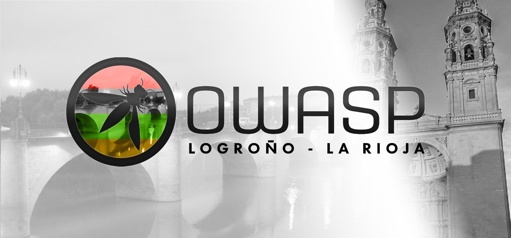

## Bienvenido

Esta es la sección OWASP de Logroño, La Rioja. Aquí encontrarás detalles sobre las reuniones que llevamos a cabo, redes sociales, etc. 

- **La sección de OWASP en Logroño (La Rioja)** es de reciente creación y esta dedicada a ser un hub de ciberseguridad, combinando buenos vinos y mejores historias para fomentar iniciativas y una comunidad de calidad.
- **Tags**: Ciberseguridad  OWASP  España  Logroño  Rioja  
- **Localización**: La Rioja
- **Grupo de Meetup**: [OWASP Logroño Chapter Meetup](https://www.meetup.com/owasp-logrono-chapter/)

## Participación

Open Worldwide Application Security Project (OWASP) es una fundación sin ánimo de lucro que trabaja para mejorar la seguridad del software. Todos nuestros proyectos, herramientas y recursos están abiertos al público, animando a cualquier persona interesada a participar.
- Las secciones (también llamadas "capítulos") son dirigidas por líderes locales siguiendo la [Política de Capítulos](/www-policy/operational/chapters). Las contribuciones económicas sólo deben realizarse en línea a través de las opciones de donación autorizadas.
- Damos la bienvenida y alentamos la participación en nuestros [Proyectos](/projects/), [Capítulos Locales](/chapters/), [Eventos](/events/), [Grupos Online](https://groups.google.com/a/owasp.com/), y el [Canal Slack de la Comunidad](https://owasp.slack.com/). OWASP ofrece una excelente oportunidad para aprender, trabajar en red y adquirir experiencia en seguridad de aplicaciones. También animamos a convertirse en [miembro](/membership/) o hacer una [donación](/donate/) para apoyar nuestros esfuerzos en curso.
