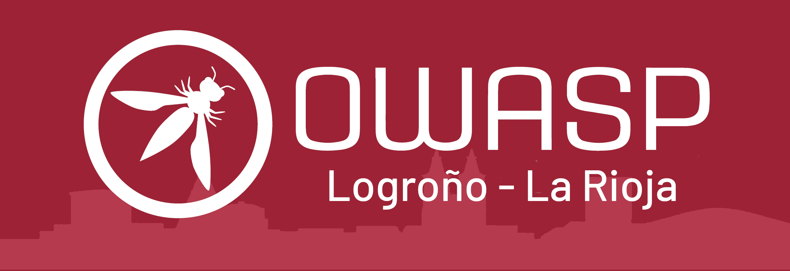

# Termina un evento...

...y empezamos a preparar el siguiente.

Ayer conocimos los principales riesgos en LLM y aplicaciones agénticas a través de los OWASP Top Ten y de la mano de Luis Marqueta, Security Engineer en IONOS.

En unas semanas hablaremos del OWASP Global AppSec EU 2026, donde enviamos una "unidad móvil" que nos contará lo más interesante de la conferencia (¡que fue mucho!)

Animaos a presentar vuestra charla, t

Una vez más, gracias a [Arsys](https://arsys.es) por ofrecer sus instalaciones para el evento.

* Página del capítulo: [https://owasp.org/www-chapter-logrono/](https://owasp.org/www-chapter-logrono/) 
* LinkedIn: [https://es.linkedin.com/company/owasp-logrono](https://es.linkedin.com/company/owasp-logrono/)
* Mastodon: [@owasp_lo](https://infosec.exchange/@owasp_lo)
* Bluesky: [@owasp-lo.bsky.social](https://infosec.exchange/@owasp_lo)

Saludos y ¡buen verano!

**El equipo de OWASP Logroño**

