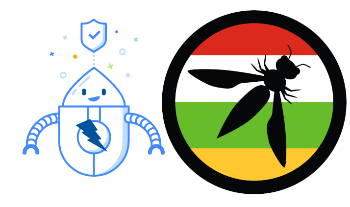

---

title: NextEvent
displaytext: Próximamente
layout: null
tab: true
order: 1
tags: logroño

---

## Taller práctico de ZAP Proxy + Charla "¿Es segura tu password?"

¡Hola a todas y todos!

Ya hay fecha para el próximo evento: será el jueves, 18 de septiembre de 2025 a las 18:30. 

Estrenamos local: Circular Universe en C/ Valdegastea, 2 (Logroño), la antigua sede de CajaRioja. ¿Qué mejor para preparar los San Mateos?

Como lo prometido es deuda, realizaremos un taller práctico de ZAP Proxy, la conocida herramienta de detección de vulnerabilidades en aplicaciones web. Se tratará también la generación de informes.

**No olvides traer tu portátil** para sacar todo el provecho posible del taller.

No es necesario tener conocimiento previo de la herramienta pero mejor si la traes instalada.

Previamente, tendremos una pequeña charla sobre la fortaleza de contraseñas. ¿Realmente son seguras? ¿Hasta cuándo? ¿Cómo puedes saberlo?

Como siempre, os recordamos que nos gustaría contar con vosotros, que alguno de los que participáis habitualmente -o no- en estas sesiones de OWASP os animéis a proponer o presentar una charla para el próximo evento. ¡Seguro que hay mucho conocimiento en la sala que valdría la pena compartir!

No hace falta que sea algo super avanzado: una experiencia práctica, una herramienta que uséis habitualmente, algún fallo curioso, la historia de vuestro primer *bug bounty*... ¡todo suma!

¿Quién se anima? 😄

Tenéis diferentes formas de contacto en el sitio web de [OWASP Logroño](https://owasp.org/www-chapter-logrono/), como:

* [LinkedIn](https://www.linkedin.com/company/owasp-logrono)
* [BlueSky](https://bsky.app/profile/owasp-lo.bsky.social)
* [Mastodon](https://infosec.exchange/@owasp_lo)
* [Meetup](https://www.meetup.com/owasp-logrono-chapter/)

y nuestros correos electrónicos.