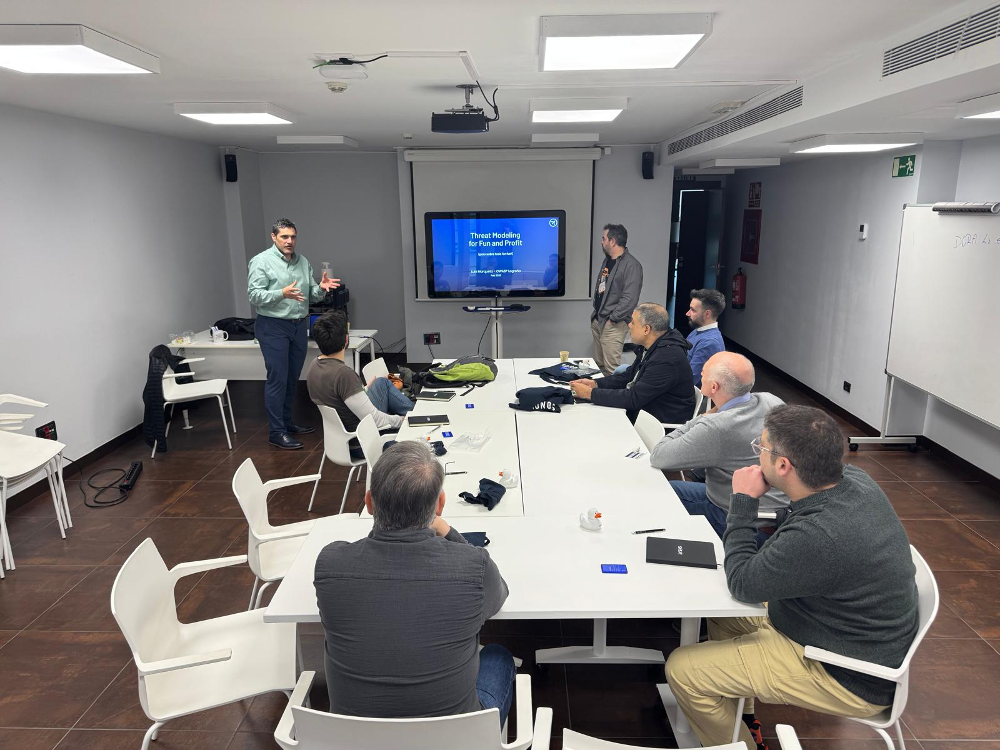
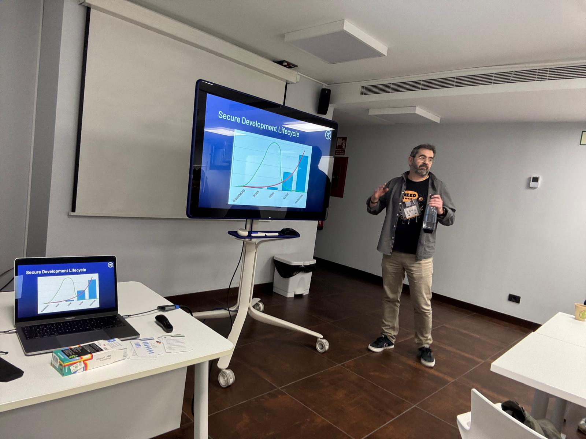
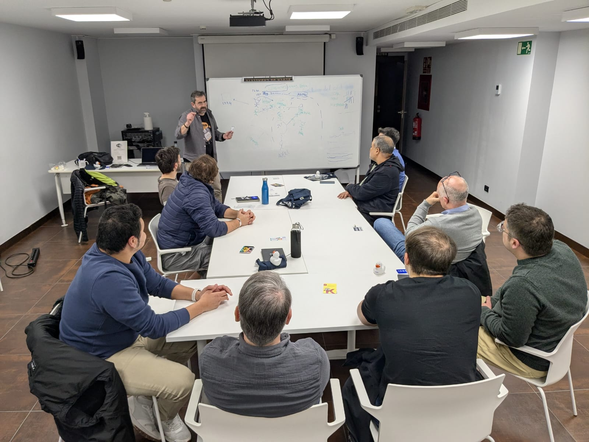

## Past Events

#### Thursday, 27th February 2025 18:00 (in-person)

El pasado jueves 27 de febrero nos reunimos para hablar de Threat Modeling. Hubo una pequeña charla por parte de Luis Marqueta antes de realizar un taller práctico usando las cartas de <a href="https://github.com/adamshostack/eop">Elevation of Privilege</a>.

Pasamos un buen rato en compañía de desarrolladores, administradores de sistemas y especialistas en seguridad, aprendimos a securizar aplicaciones desde el inicio del proyecto y compartimos unas pizzas mientras compartíamos conocimientos y experiencias.

<td>
    
</td>

<td>
    
</td>

<td>
    
</td>

Gracias a <a href="https://www.arsys.es">Arsys</a> por cedernos el espacio para el eventos y a <a href="https://www.linkedin.com/in/oscarorellanaa/">Óscar Orellana</a> y <a href="https://www.linkedin.com/in/pablogomezsanchez/">Pablo Gómez</a> por el esfuerzo de organización.

#### Thursday, 25th July 2024 04:00pm (in-person)

Our last event in Logroño was an amazing opportunity to explain about threat modeling.

In this time we have the participation as speaker Takaharu Ogaza, OWASP Sendai leader you can see the event pictures in here.

<td>
    
</td>

<td>
    
</td>

<td>
    
</td>

<td>
    
</td>

<td>
    
</td>

#### Friday, 9th Febrary 2024 10:00am (in-person)

Our last event in Logroño was an amazing opportunity to explain what OWASP means, the different participant share the field knowledge and we have a great moment.

In this time we have the participation as speaker Leocadio Marrero, David Reyes, Spyros, Oscar Orellana and Grant Onger, you can see the event pictures in here.

Soon we are shearing the videos of the event.

<td>
    
</td>

<td>
    
</td>

<td>
    
</td>

<td>
    
</td>

<td>
    
</td>

<td>
    
</td>

<td>
    
</td>
