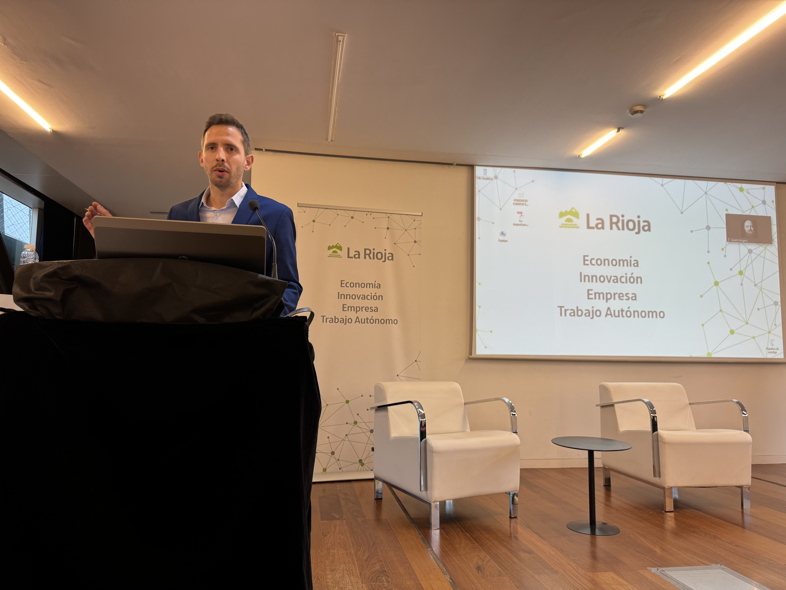

---

title: PastEvents
displaytext: Años anteriores
layout:  null
tab: true
order: 3
tags: logroño

---

## 2024

### Thursday, 23rd July 2024 04:00pm (in-person)

Los líderes del capítulo nos reunimos frecuentemente, ya sea online o de forma presencial; pero, en esta ocasión, quisimos abrir la reunión a otros asistentes interesados, compartir nuestras inquietudes y escuchar sus opiniones.

Explicamos nuestra actividad, hicimos nuestras propuestas y escuchamos ideas nuevas que seguro que iremos poniendo en marcha en el futuro más próximo.

Volvemos tras la pausa veraniega. *Stay tuned...*

PD. Muchas gracias a [Arsys](https://www.arsys.es/) por prestar sus instalaciones para la reunión.

### Thursday, 22nd May 2024 04:00pm (in-person)

Our last event in Logroño was an amazing opportunity to explain about threat modeling.

In this time we have the participation as speaker Takaharu Ogaza, OWASP Sendai leader you can see the event pictures in here.

<td>
    
</td>

<td>
    
</td>

<td>
    
</td>

<td>
    
</td>

<td>
    
</td>

### Friday, 9th Febrary 2024 10:00am (in-person)

Our last event in Logroño was an amazing opportunity to explain what OWASP means, the different participant share the field knowledge and we have a great moment.

In this time we have the participation as speaker Leocadio Marrero, David Reyes, Spyros, Oscar Orellana and Grant Onger, you can see the event pictures in here.

<td>
    
</td>

<td>
    
</td>

<td>
    
</td>

<td>
    
</td>

<td>
    
</td>

<td>
    
</td>

<td>
    
</td>
