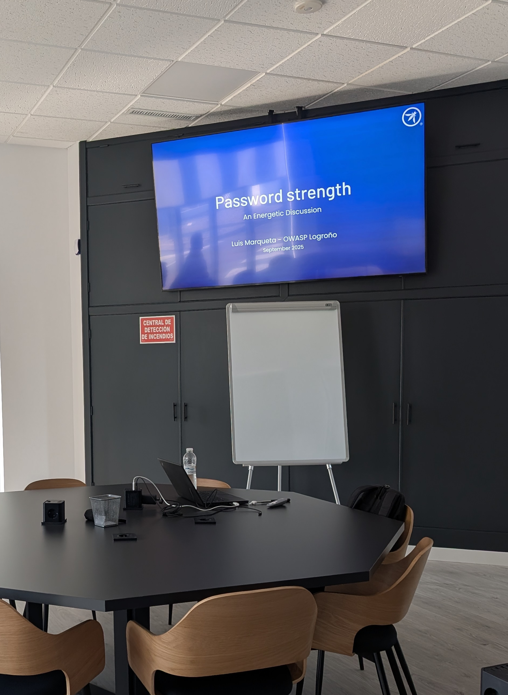
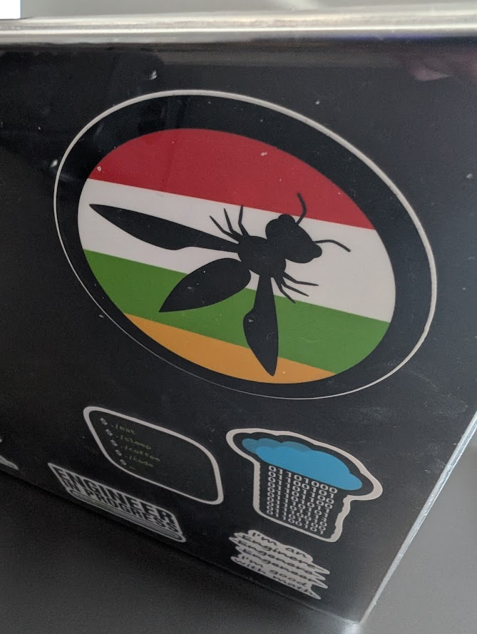
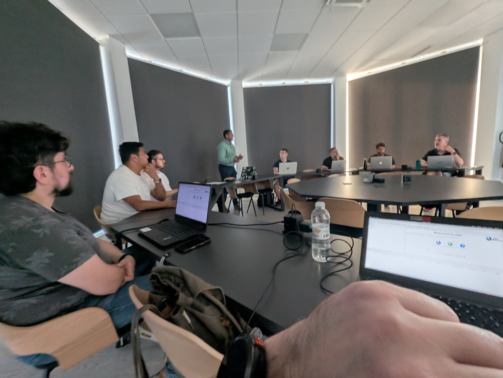
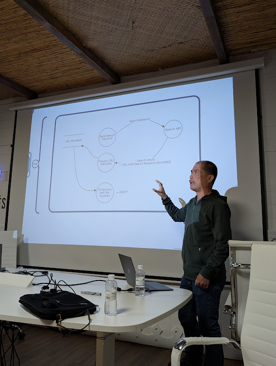
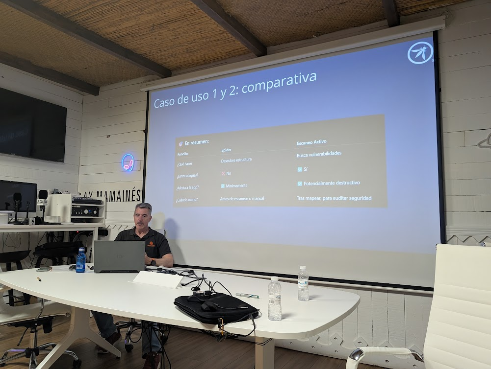
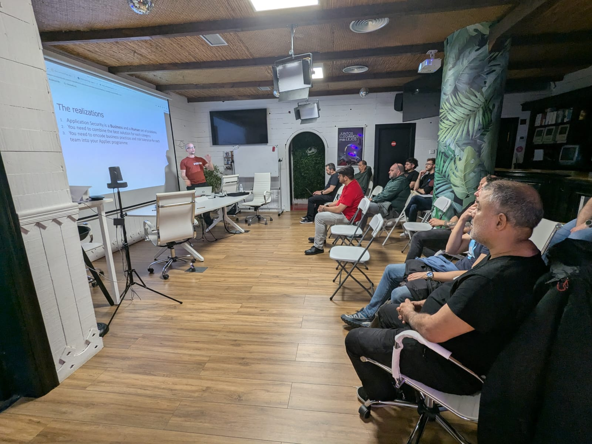
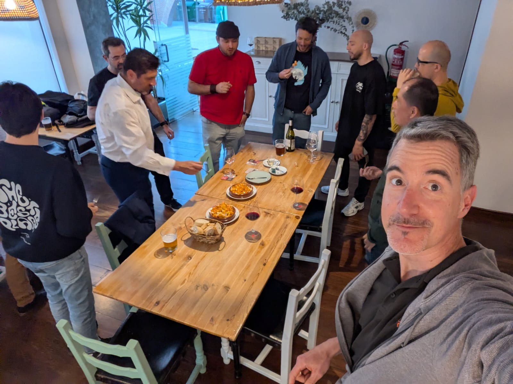
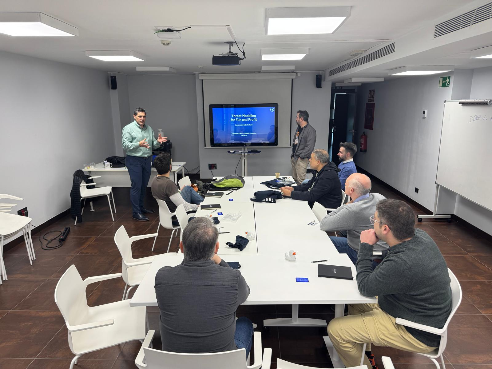
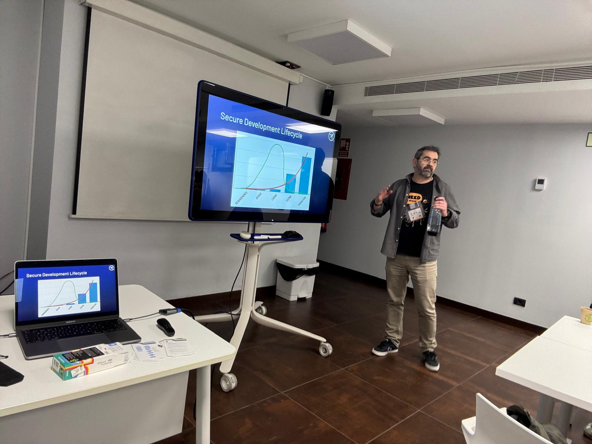
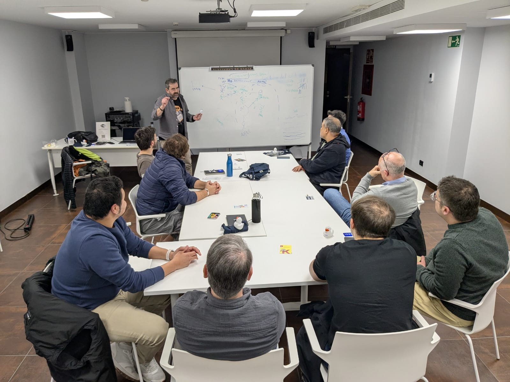

---

title: ThisYear
displaytext: Este año
layout:  null
tab: true
order: 2
tags: logroño

---

## 2025

### Jueves 18 de septiembre de 2025

En vísperas de las fiestas de San Mateo tuvo lugar una nueva sesión OWASP donde escuchamos una charla de [Luis Marqueta](https://es.linkedin.com/in/luismarqueta) sobre resistencia a ataques de fuerta bruta enfocado en el consumo de energía.

Además, [Óscar Orellana](https://es.linkedin.com/in/oscarorellanaa) dirigió un workshop en el que, además de revisar los fundamentos del proxy [ZAP](https://www.zaproxy.org/), dio una master class sobre vulnerabilidades, debilidades, patrones de ataque y cómo los proyectos [CVE](https://www.cve.org/), [CWE](https://cwe.mitre.org/), [CAPEC](https://capec.mitre.org/) y [MITRE](https://attack.mitre.org/).

Esperamos que os haya resultado interesante y que pasárais un rato agradable.

Hasta la próxima y... ¡viva San Mateo! :)

### Jueves, 22 de mayo de 2025

El 22 de mayo celebramos un nuevo evento de ciberseguridad en Logroño en el que contamos con la presencia de numerosos profesionales y entusiastas del ámbito de la seguridad. Aprovechando la cercanía del [OWASP Global AppSec EU 2025](https://genai.owasp.org/event/owasp-global-appsec-eu-2025/) que se celebra próximamente en Barcelona, varios ponentes internacionales tuvieron la deferencia de acercarse a Logroño para presentar sus charlas.

Así, pudimos disfrutar de tres charlas técnicas de primer nivel:

#### From Burp to DFD: Using Threat Modeling to Strengthen API Security

[Takaharu Ogasa](https://jp.linkedin.com/in/takaharu-ogasa-a245b7b5) es un destacado profesional japonés en el ámbito de la ciberseguridad, especializado en pruebas de penetración (pentesting) y modelado de amenazas. Es el fundador y actual líder del capítulo de OWASP Sendai, una iniciativa local de la Open Web Application Security Project (OWASP) en Japón.

En su ponencia nos habló de API Pentesting, de las limitaciones de los scanners automáticos y de la importancia del modelado de amenazas en los análisis.

#### Introducción a ZAP

[Pablo Gómez](https://es.linkedin.com/in/pablogomezsanchez), co-fundador de [Redsauce](https://www.redsauce.net/es) y co-líder de OWASP Logroño, compartió varios casos de uso prácticos de la herramienta de análisis [ZAP](https://www.zaproxy.org/).

Y esto no acaba aquí porque no todo es mostrar diapositivas; próximamente organizaremos un taller práctico para profundizar en su uso.

Material de la presentación:

* [Introducción a Zap](assets/presentaciones/Introducción%20a%20ZAP.pdf)

#### How I reduced my AppSec workload (by 70%)

[Spyros Gasteratos](https://uk.linkedin.com/in/spyr), actualmente afincado en Londres, es fundador y CEO de [Smithy.security](https://smithy.security), una empresa que desarrolla productos de código abierto para democratizar y simplificar la seguridad en el desarrollo de software.

Spyros presentó su herramienta [Smithy](https://smithy.security/), cuyo objetivo es ayudar a la orquestación de workflows que, mediante una configuración sencilla permite integrar múltiples herramientas, reducir tareas manuales repetitivas, estandarizar la seguridad en entornos DevSecOps y, así, reducir en un elevado porcentaje el esfuerzo empleado en la securización de las aplicaciones. 

Material de la presentación:

* [How I reduced my AppSec workload (by 70%)](https://github.com/smithy-security/smithy/blob/main/docs/presentations/OWASP_Logrono_Chapter_2025.pdf)

La jornada no concluyó con las charlas técnicas, sino que se prolongó en un ambiente distendido, donde tuvimos la oportunidad de seguir conversando con los ponentes y demás asistentes mientras disfrutábamos de unos vinos.

Gracias a todas las personas que asistieron porque sin ellas no tendría sentido alguno y a SDi por cedernos sus instalaciones para la ocasión.

📆 ¡Nos vemos en la siguiente cita!

### Jueves, 27 de febrero

El pasado jueves 27 de febrero nos reunimos para hablar de Threat Modeling. Hubo una pequeña charla por parte de Luis Marqueta antes de realizar un taller práctico usando las cartas de <a href="https://github.com/adamshostack/eop">Elevation of Privilege</a>.

Pasamos un buen rato en compañía de desarrolladores, administradores de sistemas y especialistas en seguridad, aprendimos a securizar aplicaciones desde el inicio del proyecto y compartimos unas pizzas mientras compartíamos conocimientos y experiencias.

<td></td> 

<td></td> 

<td></td> 

Gracias a <a href="https://www.arsys.es">Arsys</a> por cedernos el espacio para el eventos y a <a href="https://www.linkedin.com/in/oscarorellanaa/">Óscar Orellana</a> y <a href="https://www.linkedin.com/in/pablogomezsanchez/">Pablo Gómez</a> por el esfuerzo de organización.

