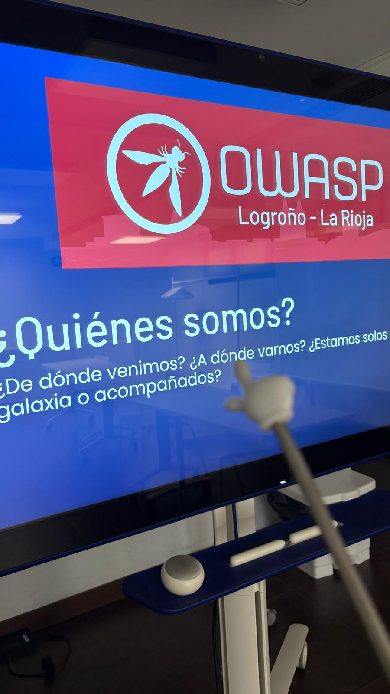
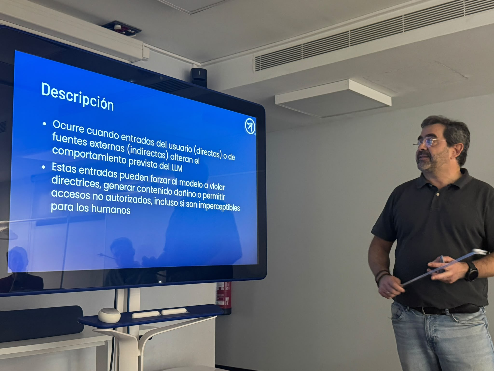
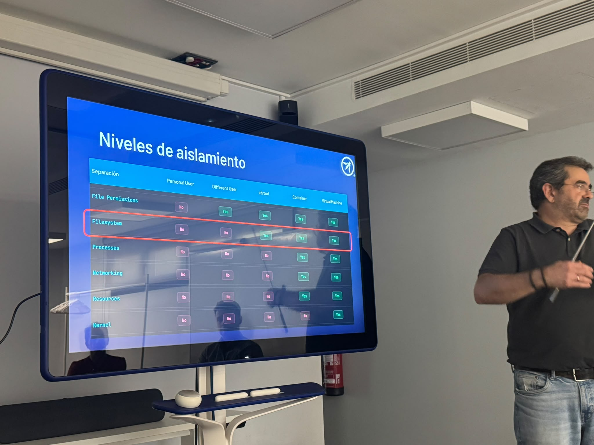

---

title: ThisYear
displaytext: Este año
layout:  null
tab: true
order: 2
tags: logroño

---

## 2026

### Jueves 16 de julio de 2026

Ayer conocimos los principales riesgos en LLM y aplicaciones agénticas a través de los OWASP Top Ten y de la mano de [Luis Marqueta](https://es.linkedin.com/in/luismarqueta), Security Engineer en IONOS.

Material de la presentación:

* [OWASP Top Ten for LLM and Agentic Applications](assets/presentaciones/OWASP%20Logro%C3%B1o%20-%20OWASP%20Top%2010%20for%20LLM%20and%20Agentic%20Applications.pdf)

